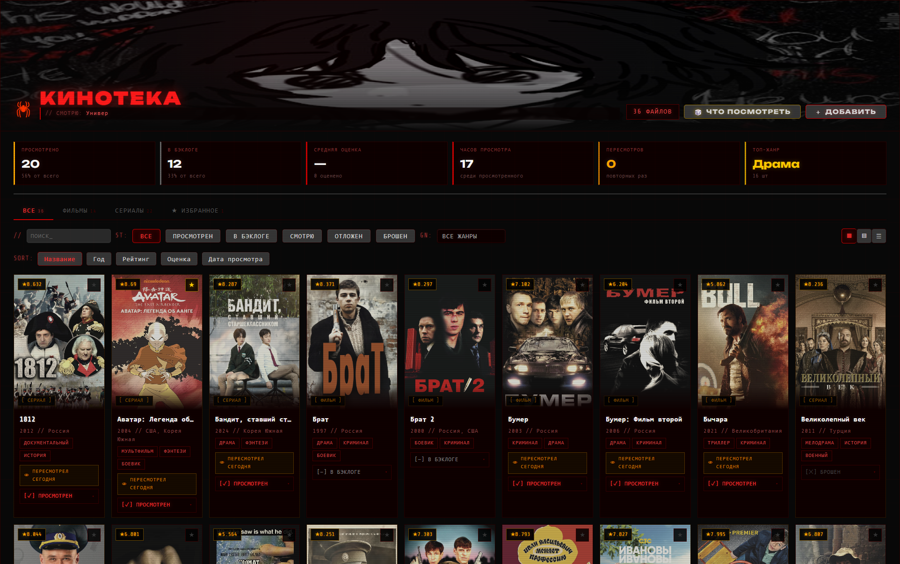
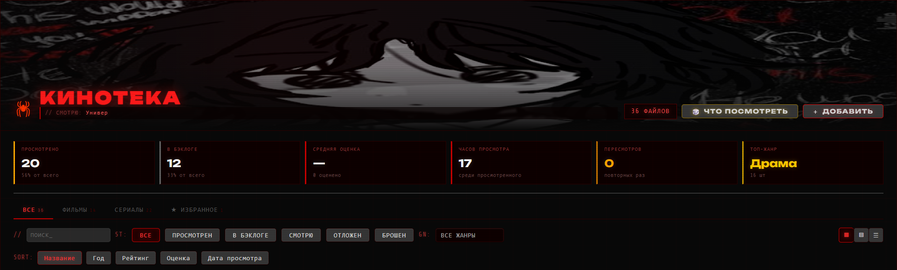

<div align="center">
  
</div>

<div align="center">

[](https://obsidian.md)
[](https://github.com/blacksmithgu/obsidian-dataview)
[](https://github.com/Alintor/obsidian-kinopoisk-plugin)
[](LICENSE)

</div>

## 📖 О проекте
Всем салют, хочу представить вам мою модель кинотеки для Obsidian, созданную с помощью плагина Dataview и Kinopoisk search. Изначально создавал чисто для себя, но может кому-то тоже будет полезно, поэтому решил выложить сюда. Код целиком и полностью написан с помощью Claude.

## ✨ Возможности

### 🎬 Управление коллекцией
- Учёт фильмов и сериалов в одной таблице через теги `фильм` / `сериал`
- Интеграция с плагином **unofficial-kinopoisk** для добавления новых записей одной кнопкой
- Автоматический парсинг YAML-метаданных: название, год, страна, жанр, режиссёр, продолжительность, рейтинг КП, постер
- Удаление фильма прямо из дашборда через контекстное меню (в корзину Obsidian)
- Открытие заметки фильма по клику на карточке

### 📊 Статусы и отслеживание
- Пять статусов: `Просмотрен` / `В бэклоге` / `Смотрю` / `Отложен` / `Брошен`
- Изменение статуса прямо в карточке через выпадающий список
- Изменение статуса через контекстное меню (ПКМ)
- Автоматическая запись текущей даты в YAML при смене на «Просмотрен»
- Автоматическое обнуление даты при снятии статуса «Просмотрен»
- Live-обновление YAML без открытия файла через Obsidian API

### 👁 История пересмотров
- Поле `История просмотров` - массив всех дат просмотров фильма
- Кнопка `👁 ПЕРЕСМОТРЕЛ СЕГОДНЯ` на карточках просмотренных фильмов
- Возможность отметить пересмотр через выпадающий список (повторный «Просмотрен»)
- Возможность отметить пересмотр через контекстное меню
- Бейдж `👁 ×N` на постере с общим количеством просмотров

### ⭐ Избранное
- Кнопка ★ в углу каждой карточки - добавление/удаление из избранного
- Запись поля `Избранное: true/false` в YAML
- Управление избранным через контекстное меню
- Отдельная вкладка `★ ИЗБРАННОЕ` со счётчиком
- Live-обновление счётчика

### 🔍 Фильтрация и поиск
- Текстовый поиск по названию и режиссёру
- Фильтр по статусу (шесть кнопок)
- Фильтр по жанру (жанры собираются автоматически)
- Четыре вкладки со счётчиками: `ВСЕ` / `ФИЛЬМЫ` / `СЕРИАЛЫ` / `★ ИЗБРАННОЕ`
- Сортировка по: название / год / рейтинг КП / личная оценка / дата просмотра
- Переключение направления сортировки (↑ / ↓)

### 📐 Режимы отображения
- **Сетка** - крупные карточки с постерами и информацией
- **Компакт** - мелкие карточки только с постерами
- **Список** - табличный вид для большой коллекции

### 📈 Статистика
Шесть live-карточек:
- Просмотренные фильмы с процентом от общего
- В бэклоге с процентом от общего
- Средняя личная оценка
- Общее количество часов просмотра
- Общее количество пересмотров
- Любимый жанр с количеством фильмов

### 🎨 Визуальный стиль
- Тёмная палитра - чёрный фон с красными акцентами
- Hero-секция с фоновым изображением
- Сканлайны и VHS/CRT-эффекты
- Шрифты `Unbounded` и `Share Tech Mono`
- Цветовая дифференциация статусов
- Оранжевые рамки для сериалов, красные для фильмов
- Hover-эффекты с подсветкой и поднятием карточек

### ✨ Интерактивные эффекты
- **Glitch-эффект** - RGB-смещение текста при смене статуса
- **Паук-курсор** - анимированный SVG-паук следует за курсором при наведении на карточки
- Плавная анимация с easing
- Поворот по направлению движения
- Автоматическое скрытие при потере фокуса

### 📌 Дополнительные индикаторы
- Бейдж рейтинга КП (★ N.N) на постере
- Бейдж типа `[ ФИЛЬМ ]` / `[ СЕРИАЛ ]`
- Индикатор `⏳` для фильмов давно в бэклоге (настраивается)
- Звёздная визуализация личной оценки (5 звёзд из 10)
- Лейбл «Что сейчас смотрю» с топ-3 текущими фильмами

### 🎲 Геймификация
- Кнопка `🎲 ЧТО ПОСМОТРЕТЬ` - случайный выбор из бэклога с автоматическим открытием

### 🖱 Контекстное меню (ПКМ)
- Открыть заметку
- Отметить пересмотр (для просмотренных)
- Добавить/убрать из избранного
- Подменю изменения статуса
- Удалить файл (с подтверждением)
- Умное позиционирование

---

## 📥 Установка

### 1. Установи зависимости

| Плагин                                                                 | Обязательность  | Назначение        |
| ---------------------------------------------------------------------- | --------------- | ----------------- |
| [Dataview](https://github.com/blacksmithgu/obsidian-dataview)          | **Обязательно** | Движок DataviewJS |
| [Kinopoisk Search](obsidian://show-plugin?id=unofficial-kinopoisk)     | **Обязательно** | Кнопка «Добавить» |

В настройках Dataview включи опцию **Enable JavaScript Queries**.

### 2. Создаём шаблоны заметок

#### 2.1. Создаём папку для шаблонов

В корне vault Obsidian создай папку `Templates` (или используй уже существующую, если она у тебя есть). Эту папку плагин Kinopoisk Search будет использовать для генерации новых заметок при добавлении фильмов и сериалов.

#### 2.2. Создаём заметку шаблона для фильмов

Внутри папки `Templates` создай новую заметку с названием `movie_template`. Открой её и вставь следующий код:

```markdown
---
Каталог: "[[Фильмы]]"
Тип: Фильм
Название: "{{name}}"
Год: {{year}}
Страна: "{{countries}}"
Жанр: [{{genres}}]
Режиссер: "[[{{director}}]]"
Продолжительность: {{movieLength}}
Статус: В бэклоге
Рейтинг: {{ratingKp}}
Оценка:
Дата просмотра:
История просмотров: []
Избранное: false
coverUrl: {{posterUrl}}
aliases:
  - "{{name}}"
  - "{{alternativeName}}"
tags:
  - фильм
---


# Описание
{{description}}

# Ссылки
- {{kinopoiskUrl}}
```

#### 2.3. Создаём заметку шаблона для сериалов

В той же папке `Templates` создай вторую заметку с названием `serials_template`. Открой и вставь:

```markdown
---
Каталог: "[[Фильмы]]"
Тип: Сериал
Название: "{{name}}"
Год: {{year}}
Страна: "{{countries}}"
Жанр: [{{genres}}]
Режиссер: "[[{{director}}]]"
Продолжительность серии: {{movieLength}}
Сезонов: {{seasonsCount}}
Серий: {{episodesCount}}
Статус: В бэклоге
Рейтинг: {{ratingKp}}
Оценка:
Дата просмотра:
История просмотров: []
Избранное: false
coverUrl: {{posterUrl}}
aliases:
  - "{{name}}"
  - "{{alternativeName}}"
tags:
  - сериал
---


# Описание
{{description}}

# Ссылки
- {{kinopoiskUrl}}
```

#### 2.4. Создай папку для будущих заметок

В корне vault создай папку `Фильмы` - именно туда плагин будет складывать создаваемые заметки фильмов и сериалов. Дашборд DataviewJS ищет записи именно в этой папке (`dv.pages('"Фильмы"')`).

> **Важно:** имя папки `Фильмы` - с заглавной буквы. Если хочешь другое имя - измени строки в начале скрипта дашборда.

#### 2.5. Что означают переменные в шаблоне

Кудрявые скобки `{{ }}` - это плейсхолдеры, которые плагин Kinopoisk Search автоматически заменит данными при создании заметки:

|Переменная|Что подставляется|
|---|---|
|`{{name}}`|Русское название|
|`{{alternativeName}}`|Оригинальное название|
|`{{year}}`|Год выпуска|
|`{{countries}}`|Страны производства|
|`{{genres}}`|Жанры через запятую|
|`{{director}}`|Режиссёр|
|`{{movieLength}}`|Длительность в минутах|
|`{{ratingKp}}`|Рейтинг Кинопоиска|
|`{{posterUrl}}`|Ссылка на постер|
|`{{kinopoiskUrl}}`|Ссылка на страницу Кинопоиска|
|`{{description}}`|Описание фильма|
|`{{seasonsCount}}`|Количество сезонов (только сериалы)|
|`{{episodesCount}}`|Количество серий (только сериалы)|

Поля `Статус`, `Оценка`, `Дата просмотра`, `История просмотров`, `Избранное` остаются пустыми или с дефолтными значениями — заполнять их будет дашборд по мере просмотра.

---

### 3. Настройка плагина Kinopoisk Search

#### 3.1. Получи API-токен

Плагин использует неофициальное API Кинопоиска, которое требует персональный токен. Чтобы его получить:

**Шаг 1.** Перейди в Telegram-бот по ссылке: **[https://t.me/poiskkinodev_bot](https://t.me/poiskkinodev_bot)**

**Шаг 2.** Нажми кнопку `START` или отправь команду `/start`.

**Шаг 3.** Бот пришлёт сообщение с твоим персональным API-токеном - это длинная строка из букв и цифр (например `ABCD12-EFGH34-IJKL56-MNOP78`). Скопируй её.

> **Важно:** этот токен привязан к твоему Telegram-аккаунту. Не делись им публично, иначе кто-то сможет израсходовать твою квоту запросов. Бесплатный лимит - 200 запросов в сутки, обычно этого хватает с запасом.

#### 3.2. Открой настройки плагина

В Obsidian зайди в **Settings** → **Community Plugins** (раздел в левой колонке) → найди **Kinopoisk Search** (или **Unofficial Kinopoisk**) → нажми на иконку шестерёнки рядом с ним.

#### 3.3. Заполни настройки

В открывшемся окне настроек заполни поля следующим образом:

|Поле|Значение|
|---|---|
|**API Token**|Вставь токен, полученный от бота|
|**Movies Folder** (папка для фильмов)|`Фильмы`|
|**Serials Folder** (папка для сериалов)|`Фильмы`|
|**Movies Template File** (шаблон фильма)|`Templates/movie_template.md`|
|**Serials Template File** (шаблон сериала)|`Templates/serials_template.md`|
|**File Name Format** (формат имени файла)|`{{name}}` или `{{name}} ({{year}})`|

> **Совет:** если выбрать формат `{{name}} ({{year}})`, то имена заметок будут вида `Груз 200 (2007).md` — это удобно когда есть несколько фильмов с одинаковым названием.

#### 3.4. Проверь что всё работает

Закрой настройки. Теперь открой палитру команд (`Ctrl+P` или `Cmd+P`) и набери `kinopoisk`. Должна появиться команда:

- **Kinopoisk search:  Search**

Запусти команду, введи название любого фильма или сериала, выбери его из списка - в папке `Фильмы` появится новая заметка с автоматически заполненными метаданными.

---

Теперь у тебя есть:

- Папка `Templates` с двумя шаблонами для генерации заметок
- Папка `Фильмы` куда будут складываться фильмы и сериалы
- Настроенный плагин Kinopoisk Search с твоим API-токеном
- Связь между плагином, шаблонами и дашбордом

Можешь переходить к **Этапу 4** - созданию дашборда и добавлению первых фильмов.

### 4. Создай дашборд

Создай заметку `Кинотека.md` и вставь содержимое файла  [](https://github.com/sonyamarmelad13/obsidian-movie-tracker/blob/main/kinoteka.md)  из этого репозитория.

### 5. Подготовь Hero-картинку

Скачай или подбери своё изображение (рекомендуемый размер высоты - **280px**, ширины  - 1400px). Положи в любую папку vault и укажи путь в начале скрипта:

```javascript
const HERO_IMAGE_PATH = "Attachments/redan-hero.png";
```
Пример как выглядит готовая шапка с картинкой:


---

## ⚙ Настройка

В начале файла `kinoteka.md` есть конфигурируемые константы:

```javascript
const HERO_IMAGE_PATH = "Attachments/redan-hero.png";  // путь к картинке
const STALE_MONTHS = 6;                                // месяцев для метки "давно в бэклоге"
const FAV_FIELD = "Избранное";                         // имя поля избранного в YAML
const HISTORY_FIELD = "История просмотров";            // имя поля истории в YAML
```

Если фильмы лежат не в папке `Фильмы/`, измени запрос:

```javascript
const filmPages = dv.pages('"ТвояПапка"').where(...)
```

---

## 📂 Структура vault

```
📁 vault/
│
├── 📄 Кинотека.md                  ← главный дашборд (DataviewJS блок)
│
├── 📁 Templates/                   ← шаблоны для плагина Kinopoisk Search
│   ├── 📄 movie_template.md        ← шаблон заметки фильма
│   └── 📄 serials_template.md      ← шаблон заметки сериала
│
├── 📁 Фильмы/                      ← сюда плагин складывает фильмы и сериалы
│   ├── 📄 Брат (1997).md           ← пример заметки фильма (тег: фильм)
│   ├── 📄 Зелёный слоник (1999).md
│   ├── 📄 Во все тяжкие (2008).md  ← пример заметки сериала (тег: сериал)
│   ├── 📄 Чики (2020).md
│   └── 📄 ...
│
└── 📁 Attachments/                 ← или любая другая папка с медиа
    └── 🖼 redan-hero.png           ← hero-картинка для шапки дашборда
```

---
## ❓ FAQ

**Q: Кнопка «+ ДОБАВИТЬ» не работает.**  
A: Установи плагин unofficial-kinopoisk. Если он установлен, но кнопка не находит команду — открой консоль (`Ctrl+Shift+I`) и проверь сообщения. Скрипт перебирает несколько ID команд автоматически.

**Q: Сериалы не отображаются.**  
A: Убедись что в YAML заметки тег `сериал`, а не `фильм`. Проверь что заметка лежит в папке `Фильмы/` (или поменяй путь в скрипте).

**Q: Hero-картинка не загружается.**  
A: Проверь что путь указан от корня vault, без слеша в начале. Открой консоль и посмотри предупреждение, скрипт сам ищет файл по имени во всём vault и подскажет правильный путь.

---

---

## 💀 Дисклеймер

Эстетика проекта вдохновлена визуалом субкультуры ЧВК "Редан". Это просто стилизация под мрачную готическую эстетику для тех, кто любит тёмные темы. Используй с любовью к кино.

---

<div align="center">

**🕷 Сделано в Obsidian с любовью к мрачной эстетике**

⭐ Поставь звезду если проект понравился

</div>
